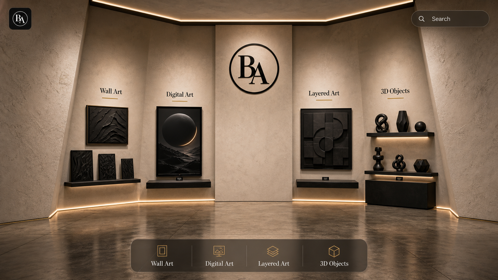

# Blender Build Brief — D20 Small-Room Storefront

> Build this in Blender as the design reference for the website. Use this with
> `docs/inspiration-references/4cat-home-web-16x9-v1.png`,
> `docs/CATALOG.md`, and `docs/ASSETS.md`.

## 1. Visual Target

Primary reference image:



The target is a compact luxury showroom, not a large gallery and not a flat web page. The home
view must read as a beautiful static composition: warm pale walls, polished floor, exact BA logo
on the center wall, black products displayed as precious objects, and only minimal navigation UI
floating over the scene.

Core rules:
- Active design has four categories only (D26): Wall Art, Digital Art, Layered Art, 3D Objects.
- Apparel is intentionally removed from the current design because no apparel mesh/source exists.
- Use `LOGO Blackaesthetics.svg` exactly as-is for the wall logo and any logo plane. Do not redraw,
  retype, trace, stylize, or reinterpret it.
- Home is static and composed. No floating/rotating products on the home view.
- Animation/free-floating behavior begins only after the user zooms into a category wall or product
  list/array, and then in the product viewer.
- Messages, category identities, and brand storytelling belong inside the environment as wall text,
  engraved panels, plaques, banners, shelf labels, or architectural signage.
- Floating HTML/UI should be navigation only: logo/home, search, category rail, back, product actions.

## 2. Floor Plan And Room Geometry

Use a shallow trapezoid showroom plan to create focus and depth.

Top-down intent:

```text
        back wall / logo wall
   ___________________________________
  /                                   \
 /                                     \
|  Wall Art  Digital  center  Layered  3D |
|  panels    panel    logo    relief   Obj|
 \                                     /
  \___________________________________/
            open camera side
```

Approximate proportions:
- Back wall width: about 9.5–10 m.
- Room depth: about 5.5–6 m.
- Wall height: about 3.5–3.8 m.
- Side walls are angled inward/outward slightly, not parallel flat slabs. The front opening should be
  wider than the back wall or angled enough that the room feels focused toward the center logo.
- Back wall stays mostly flat but gets subtle architectural depth: category recesses, shelf pockets,
  thin vertical seams, cove lighting, and shallow plinth offsets.
- The center of the back wall is intentionally quiet so the BA logo dominates.

Camera composition:
- Main home camera: frontal with slight three-quarter perspective, like the reference.
- See floor, ceiling lip, and both angled side walls. The room must not read as a flat wall.
- Logo on upper center wall; products arranged left and right around it.

## 3. Materials And Textures

Walls:
- Warm pale concrete/plaster, not pure white and not dark gray.
- Use subtle procedural noise/bump: fine plaster grain, mild variation, faint vertical trowel marks.
- Color target: warm stone/off-white/taupe, close to the reference image.
- Roughness high, no glossy wall reflection.

Floor:
- Polished warm concrete or stone, slightly darker than wall.
- Smooth, low reflection only. Enough reflection to ground black objects, but not mirror-like.
- Add subtle broad cloudy variation and faint seams. Avoid tile-grid busyness.

Products/shelves:
- Products: matte black or satin black, with visible bevels and thickness.
- Shelves/rails/plinth tops: dark charcoal/black, slightly satin, not plastic-glossy.
- Small gold/brass accents only for thin rails, category underline strokes, and warm detail lines.

Lighting:
- Warm cove light along ceiling/back-wall edge.
- Warm floor/baseboard light along the back wall.
- Track lights on left and right ceiling edges aimed at category products.
- Soft fill so black products keep visible silhouette and details.
- Avoid flat ambient fill; the product shadows are part of the luxury look.

## 4. Exact Home Layout

Four category zones from left to right:

1. Wall Art
   - Shelf-mounted black wall art panels.
   - One larger panel plus two smaller stacked panels.
   - Use the existing loaded Wall Art mesh candidates where possible.
   - Category label and gold underline are in the wall/environment.

2. Digital Art
   - One glossy/dark poster or screen-like panel on a narrow shelf.
   - Should still feel like a physical panel, not a web thumbnail.
   - Category label and underline in the wall.

3. Layered Art
   - A black panel with clear depth/layer relief.
   - If final layered geometry is not available, use a staged placeholder with real separated layers
     and label it as placeholder in `docs/ASSETS.md`.
   - Category label and underline in the wall.

4. 3D Objects
   - Right side shelf stack with black sculptural objects.
   - Use existing loaded 3D object meshes where possible.
   - Arrange vertically: top hero object, mid object, low plinth object.
   - Category label and underline in the wall.

Center:
- Exact BA logo on upper center back wall.
- Keep surrounding wall blank and calm.
- Optional central vase/plinth/bowl for composition, but it must not compete with product categories.

## 5. Environment Messages

Do not place marketing text in floating UI cards. Put the messaging into the room.

Home environment message ideas:
- Center wall logo only is acceptable for first pass.
- If extra text is needed, use a subtle engraved or plaque-like line near the center plinth:
  `Where beauty is etched into art`

Category messages should appear after category zoom as physical wall banners/plaques, not as UI panels:
- Wall Art: `Laser-cut silhouettes, framed in shadow and depth.`
- Digital Art: `Poster-scale visuals staged as luminous wall pieces.`
- Layered Art: `Stacked surfaces built for shadow, relief, and depth.`
- 3D Objects: `Printed forms, lamps, and objects staged as sculpture.`

Implementation intent:
- Home view shows only category names and subtle labels.
- On category zoom, the selected wall area can reveal/scale a physical banner plaque integrated into
  that wall bay. It should look like part of the showroom, not a website card.

## 6. Floating UI Rules

Floating UI is navigation only:
- Top-left exact logo/home button.
- Top-right search.
- Bottom category rail.
- Back/return controls.
- Product actions in detail view: variants, Add to Cart, WhatsApp, orbit controls.

Avoid:
- Floating marketing copy over the home scene.
- Large translucent text cards on top of products.
- Overlapping UI near product labels.
- UI that covers category products.

Safe UI zones:
- Top-left: logo/home button, small.
- Top-right: search, small.
- Bottom-center: category rail, below product sightline.
- Product detail: right-side panel or mobile edges only after a product is selected.

Home should remain visually clean enough that the Blender environment itself carries the story.

## 7. Product Mesh Use

Use product meshes already loaded in Blender as the source wherever possible:
- Wall Art: `BA_2D_ART_PRODUCTS_X_AXIS_LINE_3D_MESHES`.
- Digital Art: `BA_DIGITAL_ART_PRODUCTS`.
- Layered Art: current placeholders or native layered test products, clearly tracked.
- 3D Objects: `BA_3D_OBJECT_PRODUCTS`.

Do not export to GLB or wire any Blender asset into `src/` until Master Khurram approves it in
Blender. Stage review cameras first.

## 8. Blender Scene Organization

Use or create scene `BA_WEBSITE`.

Collections:
- `BA_ENV_SHELL` — walls, floor, ceiling, cove lights.
- `BA_ENV_SIGNAGE` — exact logo plane, category text, gold underlines, message plaques.
- `BA_ENV_LIGHTING` — cove, track, spots, area fills.
- `BA_CAT_WALLART`
- `BA_CAT_DIGITAL`
- `BA_CAT_LAYERED`
- `BA_CAT_3DOBJECTS`
- `BA_REVIEW_CAMERAS`

Review cameras:
- `BA_REV_HOME_FRONT` — matches the reference image composition.
- `BA_REV_HOME_34L` and `BA_REV_HOME_34R` — show angled walls and room depth.
- `BA_REV_TOP_PLAN` — proves trapezoid/tilted-wall floor plan.
- `BA_REV_CATEGORY_WALLART` — sample category zoom.
- `BA_REV_PRODUCT_VIEWER` — sample product focus.

## 9. Acceptance Checklist

The Blender pass is ready for review only when:
- The room reads as a small physical showroom, not a flat background.
- Side walls are tilted/angled enough to create depth and focus.
- Wall/floor materials match the warm luxury reference.
- Exact BA logo is visible on the center wall and not recreated.
- Home view is static, balanced, and beautiful without relying on floating copy.
- Category names/messages are physically integrated into the environment.
- Products are offset from the wall with shadows and visible thickness.
- Floating UI space is planned and not visually colliding with products.
- Black products have rim/silhouette contrast against pale surroundings.
- Review cameras are set for Master Khurram to inspect live in Blender.
